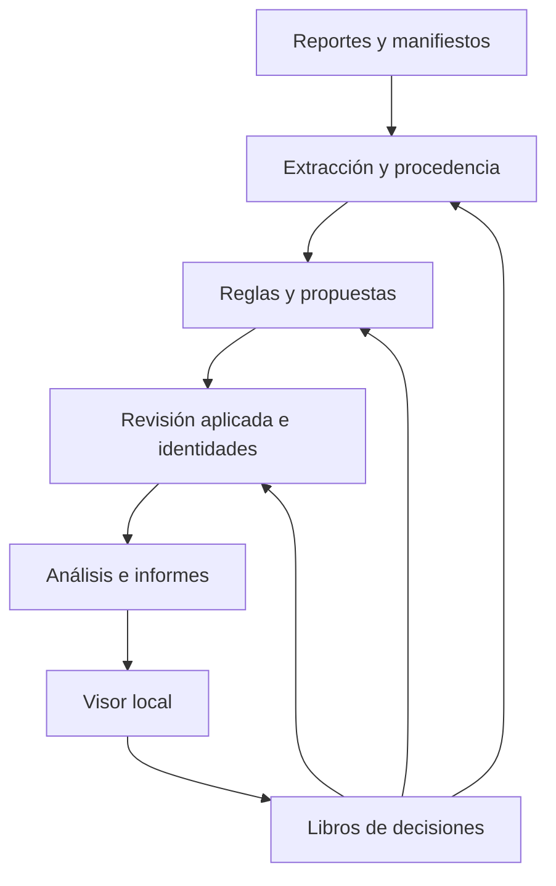

# Documentación técnica · Módulo de grafos y vinculaciones

Este documento describe la implementación del repositorio. Las constantes se consultan en [Parámetros](docs/PARAMETROS.md) y el vocabulario completo en [Modelo de datos](grafo/MODELO_DATOS.md). La [etapa siguiente](ETAPA2_VINCULACION_CONTEXTUAL.md) contiene trabajo pendiente; sus componentes no son dependencias ni capacidades instaladas.

## 1. Objetivos y alcance

El módulo transforma reportes CyberTipline en un grafo con procedencia, identifica coincidencias entre reportes, explica sus reglas y permite que una persona revise los resultados. Conserva las menciones originales y las decisiones, y reconstruye los cálculos a partir de ambos insumos. Produce un visor navegable, archivos de intercambio e informes por caso.

El funcionamiento actual es local, por archivos y en memoria. No incorpora autenticación institucional, persistencia transaccional multiusuario, clasificación automática de jurisdicciones, búsqueda vectorial, LLM ni GNN. Un legajo lógico es una agrupación calculada, no un expediente institucional creado en SIPAR. Los estados institucionales se leen de un JSON lateral; no existe una conexión activa con SIPAR.

## 2. Tecnologías y razones de uso

| Tecnología | Uso concreto | Razón técnica de la elección en esta implementación |
|---|---|---|
| Python 3.12–3.14 de 64 bits, excepto 3.14.1 | Extracción, reglas, servidor y generación de archivos | Permite un proceso local reproducible con biblioteca estándar y acceso directo a NetworkX |
| NetworkX 3.6.1 | `MultiDiGraph`, proyecciones, componentes, comunidades, centralidades y puentes | Representa relaciones paralelas con atributos y ofrece algoritmos inspeccionables sobre grafos en memoria |
| NumPy 2.5.3 y SciPy 1.18.1 | Soporte numérico y matrices dispersas que utiliza PageRank de NetworkX | Son necesarias para esa ruta de ejecución; omitirlas puede permitir iniciar y fallar al calcular |
| `http.server.ThreadingHTTPServer` | Servir el visor y recibir operaciones JSON en loopback | Evita un servicio adicional en la aplicación local; no constituye un servidor institucional de producción |
| HTML, CSS, JavaScript y SVG | Interfaz, tarjetas, conectores, temas, filtros e historial | El navegador dibuja y permite interacción sin framework ni descargas de recursos externos |
| JSON y JSONL | Fuentes, resultados y libros de decisiones | Permiten inspección, reconstrucción y exportación; los libros sobreviven a cada regeneración del grafo |
| GraphML y Markdown | Intercambio del grafo e informes | Permiten usar los resultados fuera del visor sin depender de su implementación |
| `venv`, `pip` y un iniciador BAT | Entorno aislado en Windows y otras plataformas | Evitan depender de paquetes globales y comprueban las versiones fijadas |
| Node.js 24, solo desarrollo | Ejecutar pruebas JavaScript con DOM simulado | Verifica lógica del visor sin añadir Node.js al inicio de la aplicación |

Las versiones externas están fijadas con `==` en [requisitos.txt](requisitos.txt). Sus requisitos se verificaron en las publicaciones oficiales de [NetworkX](https://pypi.org/project/networkx/3.6.1/), [NumPy](https://pypi.org/project/numpy/2.5.3/) y [SciPy](https://pypi.org/project/scipy/1.18.1/). Python 3.12 es el mínimo común de esta combinación. El iniciador comprueba las versiones instaladas, además de poder importarlas, y ejecuta `pip check`.

## 3. Arquitectura y secuencia de construcción

[grafo/construir.py](grafo/construir.py) es el punto único de orquestación. [grafo/servidor.py](grafo/servidor.py) lo invoca al iniciar y después de las operaciones persistidas.



La secuencia ejecutada es:

1. Seleccionar los reportes por su `reportId`, leer estados y conservar el hash y la ruta de cada fuente. Ante el mismo ID exacto en carpetas sucesivas, prevalece la última carpeta; duplicados dentro de una carpeta y diferencias ambiguas de mayúsculas se rechazan.
2. Extraer menciones, identificadores, observaciones y texto con ubicación de origen. Incorporar manifiestos multimedia, si fueron pasados explícitamente, y analizar descripciones de lugar.
3. Reaplicar las decisiones sobre las relaciones fuente **antes** de calcular coincidencias. Una observación rechazada no debe volver a alimentar reglas o hipótesis.
4. Calcular vinculaciones, indicios de duplicado, contradicciones e hipótesis de identidad. Incorporar vínculos establecidos por operadores.
5. Reaplicar revisiones sobre las relaciones calculadas, separar los resultados rechazados y consolidar únicamente las hipótesis de identidad validadas por personas.
6. Calcular alertas, legajos, comunidades, centralidades, candidatos y cobertura sobre el estado revisado.
7. Escribir salidas, dossier e informes. Regenerar los informes por caso y retirar los archivos de casos que dejaron de existir.

Las decisiones tienen dos aplicaciones porque las relaciones calculadas todavía no existen durante la primera. La documentación del repositorio se genera mediante otro comando y no participa en esta secuencia.

## 4. Modelo y procedencia

[nucleo.py](grafo/src/nucleo.py) mantiene un `networkx.MultiDiGraph`: dirigido, con múltiples relaciones entre los mismos nodos. `ontologia.nid` forma una clave normalizada a partir de tipo y valor. Una IP o cuenta compartida puede reutilizar su nodo; una mención de persona conserva su identidad dentro del reporte. Las variantes de atributos se conservan en `_variantes`.

Cada relación declara `relation_type`, `origin`, fuente, locator, método y versión, versión de ontología, explicación, fechas, estado de revisión y vigencia. El modo estricto rechaza relaciones sin procedencia requerida. Las fuentes incorporan hashes; los textos completos se conservan por separado en `textos_restringidos.json`.

| Origen | Significado y estado inicial |
|---|---|
| `observada` | Consta en la fuente. Nace con estado `validada` por convención del modelo; esto **no prueba una revisión humana** |
| `derivada` | Resultado reproducible de reglas. Nace pendiente |
| `inferida` | Hipótesis que requiere revisión. Nace pendiente |
| `afirmada` | Vínculo que una persona establece con fundamento. Nace validado y no lleva puntaje de confianza calculado |

`confidence` se conserva por compatibilidad. Para reglas e hipótesis expresa un puntaje **no calibrado**, no una probabilidad. Una revisión cambia el estado y la vigencia; no cambia el origen de una relación.

El ID de arista deriva de extremos, relación, método, locator y fuente mediante un hash determinista. La versión del método y la fecha de corrida se guardan como atributos, pero no cambian por sí solas ese ID. Esto permite reaplicar decisiones; también obliga a revisar su pertinencia si cambia sustancialmente la regla o la evidencia. Una decisión sin arista correspondiente se informa como huérfana, no se elimina del libro.

El vocabulario admite tipos y relaciones de intercambio que el constructor no emite actualmente. Su presencia en la tabla de ontología no acredita una función activa. `case_scope` es metadato y no implementa permisos.

## 5. Inventario de algoritmos de grafos

Todos los algoritmos de esta tabla tienen una llamada en el flujo actual o en la construcción del visor. No se deduce su uso solo de una dependencia instalada.

| Algoritmo u operación | Implementación y grafo de entrada | Para qué se utiliza y qué produce |
|---|---|---|
| Índice invertido y enumeración de pares por vecino común | `resolucion.indexar` y `vincular_reportes`, sobre relaciones vigentes | Identificar qué reportes comparten un dato y evaluar solamente los pares candidatos; conserva grupos masivos sin expandirlos |
| Proyección ponderada reporte–reporte | `analisis.proyeccion_reportes` | Colapsar vínculos suficientes en un grafo simple no dirigido para análisis; preserva todos los reportes, incluidos aislados |
| Componentes conexas | `nx.connected_components`, en `legajos_logicos` | Formar legajos lógicos con dos o más reportes conectados, también por cadenas indirectas |
| Louvain ponderado | `nx.community.louvain_communities`, en `comunidades` | Buscar grupos de reportes con conexiones internas mediante optimización de modularidad; usa `peso` y semilla 7 |
| Modularidad codiciosa, alternativa | `nx.community.greedy_modularity_communities` | Ejecutar una alternativa si Louvain falla; el resultado registra el método usado y el error que motivó la sustitución |
| Centralidad de grado | `nx.degree_centrality`, en `centralidades` | Medir la proporción de otros reportes vecinos directos. Usa el número de vecinos, no la suma de los pesos |
| Intermediación ponderada | `nx.betweenness_centrality` | Medir cuánto participa un reporte en caminos mínimos; emplea `distancia = 1 / peso`, con cálculo exacto hasta 3.000 nodos |
| PageRank ponderado | `nx.pagerank` | Ordenar reportes por conectividad recursiva usando el puntaje de los enlaces como afinidad; se calcula hasta 20.000 nodos |
| Puentes | `nx.bridges` | Identificar enlaces cuya eliminación desconecta una componente; la salida conserva hasta diez, sin ranking de importancia |
| Adamic–Adar sobre incidencia reporte–identificador | `analisis.candidatos_de_enlace`, implementación propia | Ordenar pares por identificadores investigativos compartidos, dando mayor aporte a los menos frecuentes. Devuelve candidatos explicados, sin crear aristas |
| Unión de conjuntos con compresión de caminos | `identidades.consolidar` y `_raiz` | Obtener la clausura transitiva de hipótesis de identidad validadas y crear nodos `IDENTIDAD`, sin borrar las menciones |
| Búsqueda en anchura, BFS | `render_html._camino` | Recuperar una cadena corta de procedencia entre reporte y dato dentro de la fuente del reporte; se muestra en el detalle del vínculo |
| Disposición jerárquica del lienzo | JavaScript `dibujar` y funciones de disposición en `render_html.py` | Ordenar el reporte o dato central, reportes relacionados y tarjetas desplegadas; es presentación, no una inferencia de relaciones |

### Proyección y métricas

La proyección admite `COINCIDE_CON` y `POSIBLE_DUPLICADO_DE` vigentes, no rechazadas y con puntaje suficiente para `UMBRAL_CLUSTER`. Si hay más de una arista, conserva la de mayor peso. `VINCULADO_POR_OPERADOR` entra directamente y tiene prioridad sobre una calculada. Su peso interno de proyección permite agrupar; no se presenta como certeza del sistema.

Las componentes conectan por transitividad: A–B y B–C pueden incluir A y C en el mismo legajo sin que exista una coincidencia directa A–C. Louvain puede subdividir una componente; una comunidad no demuestra autoría común.

Grado, intermediación y PageRank devuelven los diez primeros resultados. Cuando el tamaño impide calcular intermediación o PageRank, `centralidades.omitidas` explica la omisión. No existe un valor cero equivalente a «no calculada». Las centralidades describen estructura del corpus disponible, no responsabilidad, jerarquía o peligrosidad.

### Candidatos Adamic–Adar

Para dos reportes `a` y `b`, el puntaje implementado es:

`AA(a,b) = suma de 1 / ln(df(x)) para cada identificador x compartido`

`df(x)` cuenta reportes distintos con ese identificador. No se ejecuta `nx.adamic_adar_index` sobre la proyección de vínculos: se construye un índice bipartito lógico desde la procedencia. Se excluyen nodos administrativos, pares con una relación de vinculación ya materializada —incluidas las rechazadas— y grupos que exceden la política de expansión. Un par descartado por las reglas puede aparecer como candidato estructural si no tuvo arista materializada. Los quince primeros candidatos conservan sus vecinos comunes y soportes para cada lado.

## 6. Reglas y comparaciones complementarias

Estas operaciones participan en la resolución, pero no deben confundirse con los algoritmos clásicos de la tabla anterior.

| Operación | Funcionamiento actual y límite |
|---|---|
| Normalización | `normalizacion.py`: alias, email, teléfono, IP, fechas y cuenta con plataforma. Reduce diferencias de representación sin atribuir identidad de persona |
| Extracción de texto | `mineria_texto.py`: patrones y contexto controlado para identificadores; conserva el fragmento y locator. No hay un modelo lingüístico |
| Reglas deterministas | Trece reglas declaradas en `ontologia.REGLAS`; evalúan igualdad o similitud y aplican factores de frecuencia, fuente textual y condiciones de IP |
| Noisy-OR condicionado | `resolucion.combinar`: combina pesos efectivos solo si al menos una regla puede sostener el vínculo. Las corroborantes no crean una propuesta por acumulación |
| Indicios de duplicado | Coincidencia de cuenta y plataforma con proximidad temporal según la regla. Crea `POSIBLE_DUPLICADO_DE`; no elimina ni fusiona reportes |
| Hipótesis de identidad | Menciones que usan una misma cuenta reciben `POSIBLE_MISMA_IDENTIDAD`. Solo una validación humana permite consolidarlas |
| Contradicción geotemporal | Haversine entre ubicaciones de IP y velocidad implícita entre observaciones consecutivas de una misma ancla; genera `CONTRADICE`, sin invalidar por sí sola otras relaciones |
| pHash | Distancia Hamming entre huellas declaradas de 64 bits, con índice por bloques para reducir pares; conserva la comparación y el soporte. No calcula huellas desde imágenes |
| Huella de audio | Igualdad de huellas declaradas compatibles; no identifica hablantes ni analiza audio binario |
| Contexto de lugar | Léxico controlado por dimensiones, Jaccard ponderado, mínimo de dimensiones comunes y anclaje. Solo corrobora, no fusiona ubicaciones |
| Alertas | Reglas por estado, motivo de archivo, vínculo suficiente y nueva información pertinente. Propone revisar el antecedente; no reabre una actuación |

La combinación de señales es `min(0,99; 1 − producto(1 − peso_efectivo))`, redondeada a cuatro decimales, y vale cero si todas las señales son corroborantes. La forma matemática no acredita independencia entre señales ni calibración probabilística. Los valores de las trece reglas y sus factores están en [Parámetros](docs/PARAMETROS.md).

Para IP se consideran tiempo y condiciones declaradas de prestador, NAT/proxy y puerto. Las ventanas por prestador son parámetros estimados; no verifican la duración de una asignación. El prestador mostrado en la tarjeta procede de `ASIGNADA_A`, no significa titularidad de la IP.

El índice de pHash divide los 64 bits en `distancia_máxima + 1` bloques. Un par dentro de la distancia admitida debe compartir al menos un bloque; los candidatos se verifican después con Hamming exacto. No hay comparación exhaustiva obligatoria de todos los archivos.

Para texto de chat, el contexto de lugar solo incorpora líneas que puede atribuir al usuario reportado. Las descripciones semejantes conservan su procedencia, método y léxico. La redacción de informes usa plantillas deterministas en `redaccion.py`; no llama a un servicio de IA.

## 7. Entrada, salidas y contratos

### Entrada

- Reportes: objeto JSON con `reportId` y estructura compatible con `extractor_ncmec.py`. ID de 1 a 60 caracteres `[A-Za-z0-9_-]`, sin nombres reservados de Windows. Las estructuras opcionales pueden faltar; si están presentes deben ser válidas.
- Estados: `estado_institucional.json` en la carpeta de datos, según el lector del constructor.
- Multimedia: manifiestos JSON con `fileDetails`, asociados por `reportId` a reportes ya ingeridos. Se pasan mediante `--multimedia`; el botón de importación del visor recibe reportes, no manifiestos. El servidor habitual no incorpora manifiestos automáticamente.
- Decisiones: los dos libros en `grafo/estado/`.

El constructor puede recibir varias carpetas con `--datos`. El servidor local usa el dataset de demostración más `grafo/entrada/`. Para una corrida únicamente con otro corpus se ejecuta el constructor con esa carpeta explícita.

### Salidas reconstruibles

| Archivo en la carpeta de salida | Contenido |
|---|---|
| `grafo.json` | Nodos, aristas y fuentes con procedencia y revisión |
| `grafo.graphml` | Exportación GraphML; estructuras compuestas convertidas a atributos de texto |
| `analisis.json` | Resultados de reglas, revisión, algoritmos, alertas y cobertura |
| `textos_restringidos.json` | Textos completos retenidos con procedencia; no es una carpeta protegida por permisos de la app |
| `informe_crudo.json` | Dossier estructurado que alimenta la redacción |
| `informe.md` | Resumen técnico de la corrida y análisis |
| `informe_vinculaciones.md` | Informe discursivo general |
| `informes_por_caso/informe_<id>.md` | Informe discursivo recortado por caso |
| `grafo.html` | Visor autocontenido con datos e informes embebidos |

Las salidas no son los libros de decisiones y se pueden regenerar. Los IDs de legajo pueden cambiar con las componentes: no deben usarse como clave duradera para un sistema externo.

## 8. API local

La API usa JSON. Las escrituras se serializan con un candado dentro de un único proceso. `Host` y `Origin`, si este último está presente, deben corresponder al servidor local; los POST requieren `application/json`. No se exponen rutas arbitrarias del sistema de archivos.

| Método y ruta | Entrada o función |
|---|---|
| GET/HEAD `/`, `/index.html`, `/grafo.html` | Visor generado |
| GET/HEAD `/api/estado` | Disponibilidad: `ok` y `app` |
| POST `/api/importar` | `archivos`: lista de objetos con `nombre` y `contenido` JSON textual; validación previa y resultado por archivo |
| POST `/api/quitar` | `reporte`: ID de una importación que se quiere retirar |
| POST `/api/vincular` | `reporte_a`, `reporte_b`, `usuario`, `motivo` |
| POST `/api/desvincular` | `reporte_a`, `reporte_b`, `usuario`, `motivo` |
| POST `/api/decidir` | `arista`, `decision`, `usuario`, `observacion`; requiere motivo al rechazar |

`decision` admite `validada`, `rechazada` y `en_revision`. Los extremos de un vínculo deben existir. No se revisan directamente las relaciones afirmadas ni la identidad consolidada: se actúa sobre su decisión de origen.

El límite de cuerpo es 64 KiB, o 12 MiB en importación. Un lote puede tener éxito parcial, informado por archivo. La importación valida en un grafo temporal y reemplaza el archivo mediante una escritura temporal; las salidas de toda la reconstrucción no forman una transacción atómica de múltiples archivos.

Códigos: 200 operación respondida, 400 entrada inválida, 403 origen local no admitido, 404 ruta inexistente, 415 tipo de contenido incorrecto, 500 error interno. Si se guardó la operación y falló la reconstrucción, el 500 incluye `operacion_guardada: true` y una indicación de no repetirla. Al reiniciar se reconstruye desde los insumos persistidos.

## 9. Persistencia, revisión y etiquetas

[validacion.py](grafo/src/validacion.py) implementa dos libros JSONL de anexado:

- `validaciones.jsonl`: arista, decisión, operador, observación, fecha, secuencia y hashes.
- `vinculos_manuales.jsonl`: par de reportes, acción de vincular o desvincular, operador, fundamento y hashes.

Cada registro referencia el hash anterior. La verificación detecta modificaciones que rompen la cadena, pero no impide una reescritura completa ni detecta por sí sola la eliminación de una cola válida sin un anclaje externo. El campo operador tampoco autentica a la persona. Los libros son independientes del grafo reconstruido; se conserva el historial y se aplica la última decisión pertinente.

La unificación de identidades usa unión de conjuntos sobre pares validados. Una cadena A=B y B=C consolida A, B y C; las menciones permanecen. Al revertir una validación, el siguiente cálculo recompone los grupos.

**Estos eventos sirven como materia prima para un futuro conjunto etiquetado. No equivalen todavía a un dataset de entrenamiento.** Una relación observada puede figurar validada por defecto. Una validación humana debe identificarse por su evento en el libro. Además, aceptar una IP o un dato fuente no etiqueta automáticamente un par de reportes como «misma persona». El esquema de etiquetas pendiente debe conservar la pregunta revisada y el tipo de relación.

## 10. Visor e historial de navegación

[render_html.py](grafo/src/render_html.py) serializa datos y genera HTML con CSS y JavaScript embebidos. El lienzo usa SVG y disposición jerárquica, sin `spring_layout`. Los dos temas conservan el significado de colores con tonos adaptados; interfaz, informes embebidos y grafos usan fuentes sin serif.

El estado contiene caso, raíz, dato central, reportes desplegados, filtros, selección, movimientos y encuadre. Las instantáneas de navegación guardan los campos que afectan el dibujo. Las fichas laterales conservan su posición y secciones abiertas. Volver/Adelante restaura la vista; la persistencia de decisiones se mantiene por separado.

La marca «en N reportes ›» cuenta reportes distintos del caso, no aristas. El puntero resalta las cajas de esos reportes sin redibujar y la marca centra el dato. Si el texto no cabe, un punto ofrece la misma acción y ayuda. Se admite clic y teclado sin seleccionar o arrastrar accidentalmente la tarjeta. El interruptor de cruces también se guarda en el historial.

Al recrear tarjetas, la función de medida debe escribir el texto incluso cuando reutiliza un ancho en caché. Las pruebas cubren este caso porque un fallo allí vuelve invisible el contador después del primer clic. Los motivos y flechas usan el color de su relación; el grosor representa peso salvo en vínculos manuales. El fondo invertido identifica la raíz.

Las ubicaciones de origen se traducen a etiquetas legibles. Los locators originales permanecen en auditoría. El informe distingue las coincidencias que las reglas no sostienen de los vínculos establecidos por operadores.

## 11. Verificación y mantenimiento

[verificar.py](verificar.py) reúne las comprobaciones: integridad del entorno con `pip check`, compilación Python, invariantes en `grafo/pruebas.py`, pruebas HTTP y de persistencia mediante `unittest`, lógica JavaScript de navegación y lienzo, y vigencia de las referencias generadas. Comprueba también enlaces locales de los Markdown.

Las pruebas operan en carpetas temporales y no deben cambiar los libros ni los reportes del repositorio. Cubren rechazos y revalidación, reconstrucción, errores de importación, pérdida de contadores al redibujar, accesibilidad del botón de apariciones, colores, origen local de escrituras y fallos posteriores a persistir una operación. Las pruebas JavaScript emplean DOM simulado: no sustituyen una inspección visual ni pruebas de interacción en navegadores reales.

La verificación de dependencias consulta versiones e incompatibilidades. Una auditoría con `pip-audit -r requisitos.txt` consulta vulnerabilidades conocidas; un resultado sin hallazgos no garantiza ausencia de vulnerabilidades desconocidas.

Para actualizar referencias después de cambiar constantes:

```bash
python grafo/documentar.py
python verificar.py
```

La comprobación `python grafo/documentar.py --comprobar` falla si modelo o parámetros difieren del código. El documento arquitectónico se mantiene a mano y solo debe describir rutas ejecutadas. Los tiempos de cálculo y capacidad máxima requieren medición con el corpus real; esta implementación reconstruye todo en memoria y no ofrece un SLA de escalabilidad.
