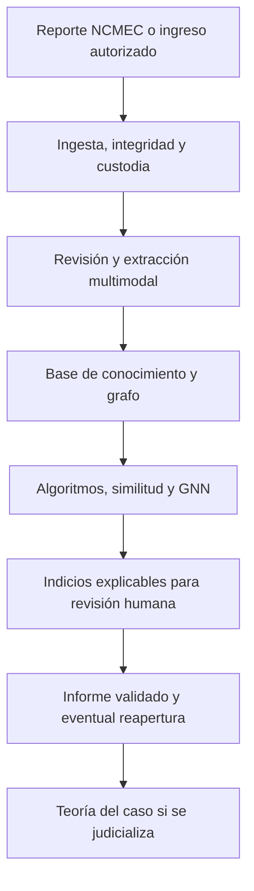

# Contexto integral del proyecto: Bóveda CIJ, análisis multimodal y grafos

## 1. Propósito de este documento

Este archivo reúne el contexto funcional, institucional y técnico trabajado hasta el momento para que pueda incorporarse al proyecto sin reconstruirlo desde cero.

No debe interpretarse como una especificación técnica cerrada. El proyecto todavía se encuentra en una etapa de relevamiento, diseño y validación. Existen capacidades que forman parte de la visión de producto o de una narrativa comercial, pero cuya implementación real todavía debe comprobarse. En todo momento debe distinguirse entre:

1. funcionamiento actual de la institución;
2. necesidades y reglas de negocio verificadas;
3. capacidades ya existentes en prototipos;
4. funcionalidades propuestas para el piloto;
5. ideas de evolución futura todavía no validadas.

El objetivo inmediato al trabajar con el código es documentar primero qué existe, qué funciona y qué falta. No se deben presentar como implementadas capacidades que solamente aparecen en documentos, maquetas, transcripciones o demostraciones.

---

## 2. Resumen ejecutivo

El proyecto busca construir una plataforma institucional, local y soberana para gestionar de punta a punta casos vinculados con abuso sexual infantil y evidencia digital sensible.

La plataforma no debe limitarse a guardar archivos. Debe integrar:

- recepción y organización de reportes y actuaciones;
- preservación de evidencia y cadena de custodia;
- análisis de documentos, imágenes, audios y videos;
- extracción estructurada de personas, cuentas, teléfonos, direcciones IP, dispositivos, lugares, hechos y eventos;
- trazabilidad de cada dato hasta su fuente original;
- revisión y validación humana;
- generación de informes;
- relación entre reportes, casos, personas, lugares, cuentas y evidencia;
- recuperación de antecedentes y eventual reapertura de casos archivados;
- asistencia posterior para la construcción de la teoría del caso.

La nueva línea de grafos tiene una finalidad central: convertir el conjunto acumulado de reportes y evidencia en una base de conocimiento que pueda encontrar relaciones que hoy no son visibles cuando cada reporte se analiza de forma aislada.

El sistema no debe inferir culpabilidad. Debe producir indicios o hipótesis de vinculación explicables, con fuente, método, fecha, nivel de confianza y estado de validación, para que un investigador determine si corresponde profundizar la investigación o reabrir un caso.

---

## 3. Problema institucional que se busca resolver

La institución recibe un volumen elevado de reportes. Según el relevamiento preliminar, aproximadamente entre el 20 % y el 30 % presenta elementos suficientes para continuar. En consecuencia, cerca del 70 % se archiva por falta de evidencia, falta de datos para atribuir una conducta, imposibilidad de determinar jurisdicción o insuficiencia del material recibido.

El archivo no significa que el reporte sea falso ni que constituya un caso negativo. Significa que, en ese momento, no existen elementos suficientes para avanzar. Los reportes permanecen conservados y pueden reabrirse si posteriormente aparece:

- una nueva coincidencia de cuenta, alias, teléfono o correo electrónico;
- una IP relacionada, siempre considerada junto con fecha y hora;
- un mismo dispositivo o identificador técnico;
- una conexión con otra persona, lugar, hecho o reporte;
- una recategorización;
- nueva evidencia o respuesta de un prestador;
- una coincidencia conceptual o multimodal que justifique revisión.

El propósito estratégico es transformar ese universo archivado en una reserva activa de conocimiento. Un nuevo ingreso debería poder activar antecedentes y mostrar por qué una conexión puede ser relevante.

Los reportes archivados no deben utilizarse automáticamente como ejemplos negativos para entrenar modelos. En términos de aprendizaje automático, son principalmente datos no etiquetados: la ausencia de evidencia suficiente no demuestra la inexistencia del hecho.

---

## 4. Proceso actual relevado — AS-IS

Esta sección describe el proceso actual de la institución. No incorpora todavía la bóveda, la inteligencia artificial ni los grafos como si ya formaran parte del circuito.

### 4.1 Recepción de reportes

1. NCMEC realiza una categorización preliminar y envía el reporte al MPF.
2. El reporte debe estar asignado al país desde la herramienta de NCMEC para que pueda visualizarse en SIPAR.
3. Los reportes se transfieren a la infraestructura del MPF y migran a SIPAR. La migración se ejecuta una vez al día, aproximadamente a las 6:00, aunque puede forzarse manualmente.
4. El contenido puede incluir un PDF estandarizado, archivos JSON o XML y material multimedia. La información disponible cambia según la red social o el proveedor de origen.

### 4.2 Distribución y prioridad

- El trabajo se distribuye entre aproximadamente diez operadores, normalmente según la red social de origen y la carga disponible.
- Cada reporte debe quedar asignado a una persona responsable.
- Las prioridades preliminares relevadas son:
  - Prioridad 1: riesgo de vida.
  - Prioridad 2: imágenes de producción casera.
  - Prioridad 3: denuncia de un particular.
  - Categoría E: reporte común sin prioridad especial.
- El operador puede recategorizar el reporte a partir del contenido efectivamente revisado.

### 4.3 Revisión preliminar

El operador abre cada reporte y analiza:

- datos del usuario;
- cuenta o alias;
- teléfono;
- dirección IP junto con fecha y hora;
- imágenes, videos y textos;
- idioma;
- cantidad y tipo de archivos;
- contexto general;
- coincidencias objetivas con otros reportes.

Una dirección IP aislada no identifica por sí sola a una persona. Debe conservar siempre sus dimensiones temporales, el proveedor, la zona de cobertura y, cuando corresponda, puerto u otros datos técnicos.

Actualmente una relación debe apoyarse en datos objetivos coincidentes. No se establece únicamente por semejanza contextual.

### 4.4 Determinación de jurisdicción

- Se utilizan ubicación declarada, geolocalización informada, prefijo telefónico y otros datos disponibles.
- Si la jurisdicción depende de una IP, pueden consultarse LACNIC, ENACOM, CABASE u otras fuentes.
- SIPAR genera un oficio sobre un modelo y completa parte de la información.
- La respuesta del proveedor puede demorar aproximadamente una semana.
- Las IP bajo NAT pueden impedir la atribución individual y dejar el reporte pendiente o archivado de forma latente.
- En hechos graves pueden solicitarse datos adicionales, como IP de inicio de sesión o de registración.

### 4.5 Evaluación, archivo y reapertura

- Si existe mérito, el reporte continúa hacia investigación, derivación o judicialización.
- Si no existen elementos suficientes, se archiva, pero no se elimina.
- Pueden archivarse, entre otros supuestos, reportes sin archivos, sin datos de usuario, no atribuibles o con material sin relevancia suficiente.
- El contexto y las conexiones futuras pueden modificar esa evaluación.

### 4.6 Derivación y judicialización

- Una vez determinada la jurisdicción, SIPAR permite derivar el reporte al responsable correspondiente.
- El registro original y su historial se conservan.
- Cuando un caso de CABA se judicializa, actualmente se crea manualmente un expediente en KIWI.
- No existe un traspaso automático entre SIPAR y KIWI.
- Una vez que el caso pasa a KIWI, allí continúa la gestión documental y operativa del caso judicializado.

### 4.7 Conservación, permisos y estadísticas

- Los reportes deben conservarse incluso si fueron archivados.
- Los usuarios tienen permisos según función y jurisdicción.
- Se elaboran estadísticas sobre ingresos, prioridades, redes de origen, archivos, reaperturas y recategorizaciones.

---

## 5. Qué es la Bóveda

La Bóveda, denominada en distintos materiales Bóveda Cuántica, Prometea Cuántica o Quantum Studio, es la capa institucional destinada a custodiar, organizar, analizar y disponibilizar evidencia digital sensible dentro de infraestructura controlada por el MPF.

La idea principal no es una simple carpeta cifrada. Es un entorno de trabajo local en el que el expediente, la evidencia, la actividad de los usuarios, los resultados de la inteligencia artificial y las validaciones humanas conservan una historia común y auditable.

### 5.1 Propiedades centrales buscadas

- funcionamiento on-premise;
- ausencia de procesamiento de evidencia sensible en nubes públicas o servicios externos no autorizados;
- posibilidad de operar en una red aislada o fuertemente restringida;
- preservación del archivo original;
- control de integridad mediante hashes;
- cadena de custodia;
- permisos granulares por rol, caso y jurisdicción;
- registro de accesos, análisis, modificaciones, validaciones y exportaciones;
- visualización controlada de evidencia;
- vinculación permanente entre resultados derivados y fuentes originales;
- procesamiento local mediante modelos residentes;
- exportaciones controladas y diferenciación entre información interna y material entregable a terceros.

### 5.2 Capacidades descriptas en la visión funcional

Los materiales existentes describen o proponen, entre otras, las siguientes capacidades:

- encapsulado de archivos en un contenedor `.qaif`;
- cifrado poscuántico y uso eventual de aleatoriedad física cuántica;
- línea de tiempo del expediente;
- Evidence Vault o bóveda de evidencias;
- cadena de custodia por archivo y expediente;
- chat cifrado por caso;
- editor colaborativo de documentos;
- anotaciones sobre un punto y tiempo específico de imágenes, audios o videos;
- notas privadas o compartidas con exclusión selectiva al exportar;
- informes PDF y visualizador externo protegido;
- firmas electrónica, digital y una denominada firma o sello cuántico;
- anclaje de huellas en blockchain o registros distribuidos;
- pruebas de conocimiento cero para acreditar existencia o integridad sin revelar contenido;
- controles contra capturas, grabaciones o fotografías de pantalla;
- marcas de agua forenses asociadas al usuario;
- registro append-only o libro de auditoría encadenado mediante hashes.

### 5.3 Advertencia sobre el estado real de estas capacidades

La lista anterior representa la visión integral o narrativa funcional de la plataforma. No constituye prueba de que todos esos componentes existan o estén activos.

La transcripción del proyecto indica expresamente que, al menos en el momento de la demostración, la biometría facial, la biometría de voz y la huella de escritura estaban desactivadas y podían mostrarse de forma simulada. Por lo tanto:

- no asumir que esas funciones están implementadas;
- no simular validaciones como si fueran controles reales en un sistema productivo;
- no asumir que `.qaif`, la firma cuántica, el anclaje blockchain, las pruebas ZK o los controles anti-captura tienen una especificación técnica definitiva;
- solicitar o localizar especificaciones, repositorios, contratos de interfaz y pruebas antes de integrarlos;
- evitar afirmaciones como “indestructible”, “imposible de adulterar” o “no hackeable” en documentación técnica.

El cifrado poscuántico no implica necesariamente utilizar una computadora cuántica: normalmente consiste en algoritmos clásicos diseñados para resistir ataques de computación cuántica. Toda integración “cuántica” debe quedar respaldada por una especificación verificable que identifique algoritmo, proveedor, flujo de claves, formato, dependencia externa y evidencia de funcionamiento.

---

## 6. Visión funcional de punta a punta

El objetivo es pasar de herramientas aisladas a un flujo continuo de caso:

El flujo conceptual completo es:

1. ingreso del reporte y sus archivos;
2. preservación, hash y registro de procedencia;
3. clasificación y priorización;
4. análisis preliminar y jurisdiccional;
5. diligencias u oficios necesarios;
6. extracción de entidades, eventos y relaciones;
7. análisis individual y transversal de documentos y multimedia;
8. comparación con antecedentes activos y archivados;
9. producción de hipótesis o alertas de vinculación;
10. revisión y validación humana;
11. informe del operador o visualizador;
12. inventario consolidado de evidencia;
13. entrega al fiscal de la información validada;
14. módulo de teoría del caso para casos judicializados;
15. registro de todo el proceso sin perder la relación con las fuentes.

---

## 7. Roles y separación de responsabilidades

### Operador o investigador

- recibe casos asignados;
- revisa datos y evidencia;
- valida o rechaza propuestas de la IA;
- corrige entidades y relaciones;
- confecciona o valida informes;
- deja constancia de decisiones y observaciones.

### Analista o visualizador

- examina material audiovisual;
- identifica segmentos relevantes;
- valida descripciones y eventos;
- produce un informe de acuerdo con su competencia;
- vincula cada afirmación con el video y timestamp correspondiente.

### Fiscal

Debe recibir una vista consolidada que diferencie claramente:

- evidencia original;
- evidencia pendiente de análisis;
- hallazgos propuestos por IA;
- hallazgos validados por una persona;
- informes humanos;
- antecedentes y conexiones;
- cronología;
- inventario de prueba;
- biblioteca normativa;
- hipótesis o teoría del caso.

### Administrador y auditor

- administra usuarios, roles, jurisdicciones y permisos;
- supervisa registros de auditoría;
- controla políticas de retención, exportación y acceso;
- no debe poder alterar silenciosamente el historial.

---

## 8. Módulo de análisis de video y multimedia

Existe una línea de desarrollo asociada al repositorio `CarolinaMMartin/video-assistant`. Claude Code deberá inspeccionar el repositorio antes de asumir su estado actual.

La intención funcional trabajada es:

- cargar un video y preservar el archivo original;
- utilizar FFmpeg para obtener metadatos, audio, frames o segmentos;
- transcribir audio con un componente intercambiable, por ejemplo Whisper;
- analizar imágenes o frames con un modelo multimodal;
- generar descripciones y eventos con timestamps;
- conservar para cada hallazgo la fuente y el segmento exacto;
- permitir análisis individual de un video y análisis transversal de varios videos asociados a un mismo usuario o caso;
- vincular el contenido con correos, posteos, documentos u otra evidencia;
- generar un JSON estructurado y trazable;
- mostrar propuestas de la IA para revisión humana;
- convertir los resultados validados en un informe para el fiscal y en datos para la base de conocimiento.

Se había propuesto una extracción de frames aproximadamente cada cinco segundos como punto de partida experimental, no como frecuencia definitiva. La estrategia debe poder adaptarse mediante:

- muestreo uniforme;
- detección de cambios de escena;
- extracción de keyframes;
- segmentación temporal;
- análisis adicional de intervalos señalados por el operador o por un detector.

Arquitectura preliminar previamente considerada:

- Python;
- FastAPI;
- Docker;
- FFmpeg;
- modelos locales configurables por variables de entorno;
- Qwen y Whisper como componentes sustituibles, no dependencias rígidas;
- API con contratos explícitos;
- estados auditables del procesamiento.

Estados conceptuales del pipeline:

`RECIBIDO → PREPROCESANDO → TRANSCRIBIENDO → EXTRAYENDO_EVENTOS → ANALIZANDO → VERIFICANDO → DISPONIBLE`

La estrategia de trabajo original era desarrollar localmente y entregar luego el componente containerizado al equipo que realizará el despliegue dentro de la Bóveda.

---

## 9. Evolución de repositorio documental a base de conocimiento

La Bóveda debe evolucionar desde una estructura centrada en carpetas hacia un sistema que comprenda entidades, eventos y relaciones sin perder los archivos originales.

La base de conocimiento debe permitir:

- detectar posibles duplicados;
- identificar actuaciones relacionadas;
- correlacionar ingresos nuevos con antecedentes;
- agrupar casos y elementos por diferentes señales;
- buscar por datos exactos y por significado;
- reconstruir una línea de tiempo;
- navegar desde una persona hacia sus cuentas, dispositivos, lugares, evidencia y casos;
- navegar desde una evidencia hacia todos los casos y entidades en los que aparece;
- explicar cómo se obtuvo cada relación;
- notificar cuando un nuevo dato modifica el valor investigativo de un caso archivado.

El grafo no reemplaza el expediente, la bóveda de objetos ni la base transaccional. Es una representación relacional y analítica complementaria.

---

## 10. Objetivo específico del módulo de grafos

El usuario no debe tener que construir manualmente todas las conexiones. El sistema debe proponer relaciones mediante reglas, algoritmos y modelos, manteniendo siempre revisión humana.

Ejemplos de preguntas que debería poder asistir:

- ¿Qué reportes comparten una cuenta, alias, teléfono, correo, IP y franja temporal?
- ¿Qué personas o cuentas aparecen conectadas con un mismo dispositivo o lugar?
- ¿Qué evidencias contienen entidades, objetos, escenas o eventos relacionados?
- ¿Qué casos aparentemente aislados forman una comunidad o patrón recurrente?
- ¿Qué nodo actúa como intermediario entre grupos?
- ¿Qué nuevo reporte aporta el dato que faltaba en un caso archivado?
- ¿Qué conexiones son hechos observados y cuáles son inferencias todavía no validadas?
- ¿Qué documentos o segmentos multimedia justifican cada vínculo?

### 10.1 Tres clases obligatorias de relaciones

Toda conexión debe clasificarse como una de estas categorías:

1. **Observada:** surge directamente de una fuente. Ejemplo: el reporte informa una cuenta y una IP en una fecha determinada.
2. **Derivada:** surge de una regla determinista o transformación reproducible. Ejemplo: dos menciones normalizadas corresponden al mismo número telefónico.
3. **Inferida:** surge de similitud, algoritmo, modelo de machine learning, LLM o GNN. Es una hipótesis y requiere validación.

Nunca mezclar estas categorías en la interfaz ni en la persistencia.

### 10.2 Entidades preliminares del grafo

La ontología todavía debe validarse con especialistas, pero el modelo inicial puede considerar:

| Tipo de nodo | Ejemplos |
| --- | --- |
| Reporte o caso | reporte NCMEC, actuación, expediente, caso archivado |
| Persona | investigado, víctima, denunciante, tercero, funcionario |
| Identidad digital | cuenta, usuario, alias, perfil, correo electrónico |
| Telecomunicación | teléfono, dirección IP, sesión, puerto, proveedor |
| Dispositivo | teléfono, computadora, identificador o artefacto técnico |
| Lugar | domicilio, ciudad, jurisdicción, coordenada, establecimiento |
| Organización | plataforma, empresa, proveedor, organismo, fiscalía |
| Evidencia | imagen, video, audio, documento, mensaje, archivo contenedor |
| Segmento | frame, escena, clip, fragmento de audio, página, párrafo |
| Evento | acceso, comunicación, carga, envío, aparición, diligencia |
| Documento | reporte, oficio, respuesta, informe, acta, resolución |

Los roles de una persona deben modelarse con cuidado. Una misma persona puede tener roles distintos según el caso. No deben convertirse en propiedades permanentes del nodo de identidad.

### 10.3 Relaciones preliminares

Ejemplos de aristas:

- `PERTENECE_A_CASO`;
- `REPORTADO_EN`;
- `MENCIONA`;
- `APARECE_EN`;
- `USA_CUENTA`;
- `ASOCIADO_A_TELEFONO`;
- `OBSERVADO_DESDE_IP`;
- `USA_DISPOSITIVO`;
- `UBICADO_EN`;
- `OCURRE_EN`;
- `COMUNICA_CON`;
- `COINCIDE_CON`;
- `POSIBLE_MISMA_IDENTIDAD`;
- `DERIVADO_DE`;
- `VALIDADO_POR`;
- `CONTRADICE`;
- `RESPONDE_A`;
- `PERTENECE_A_JURISDICCION`;
- `RELACIONADO_CON`.

El nombre definitivo de cada relación debe surgir de una ontología controlada. Se deben evitar aristas genéricas si existe una relación específica y comprobable.

### 10.4 Metadatos mínimos de una arista

Cada relación debe poder almacenar o referenciar:

- `source_evidence_id`;
- `source_locator` —página, timestamp, frame, campo JSON u otra ubicación—;
- `relation_type`;
- `origin` —observada, derivada o inferida—;
- `method` y versión del algoritmo o modelo;
- `confidence` cuando corresponda;
- `observed_at` o intervalo temporal;
- `created_at`;
- `validation_status`;
- `validated_by`;
- `validated_at`;
- `case_scope` y permisos;
- explicación legible;
- estado de vigencia o impugnación.

El grafo debe admitir múltiples relaciones entre los mismos nodos. Dos personas pueden estar relacionadas por una comunicación, un lugar, un archivo y una coincidencia temporal, cada una con fuente y fuerza diferente.

---

## 11. Capas de análisis inteligente

No existe un único componente que “encuentre todas las relaciones”. La estrategia debe combinar varias capas.

### 11.1 Reglas deterministas

Primer nivel, altamente explicable:

- normalización de teléfonos, correos, usuarios e IP;
- coincidencias exactas;
- coincidencias dentro de ventanas temporales;
- reglas de jurisdicción;
- enlaces entre oficios y respuestas;
- hashes de archivos;
- metadatos técnicos compatibles.

### 11.2 Resolución de entidades

Debe determinar si distintas menciones pueden corresponder a la misma entidad mediante:

- reglas y diccionarios;
- NER;
- similitud textual;
- aliases y variantes ortográficas;
- datos técnicos coincidentes;
- restricciones temporales y contextuales;
- revisión humana.

No debe fusionar definitivamente nodos por una única señal débil. Conviene representar primero una relación `POSIBLE_MISMA_IDENTIDAD` con explicación y confianza.

### 11.3 Algoritmos clásicos de grafos

Antes de una GNN, el sistema puede producir valor con algoritmos explicables:

- componentes conectados;
- caminos entre dos nodos;
- caminos mínimos;
- centralidad de grado;
- centralidad de intermediación;
- centralidad de cercanía;
- PageRank o eigenvector centrality;
- detección de comunidades mediante Louvain o Leiden;
- vecinos comunes;
- Jaccard y Adamic–Adar;
- detección de puentes;
- análisis de coocurrencia;
- patrones o motivos de red;
- análisis temporal de aparición y crecimiento de comunidades.

Una centralidad alta no significa culpabilidad ni liderazgo criminal. Solo describe una posición estructural dentro del grafo construido con los datos disponibles.

### 11.4 Búsqueda semántica y modelos de lenguaje

La información no estructurada requiere:

- OCR;
- transcripción;
- extracción de entidades y relaciones;
- embeddings de texto y, progresivamente, de imagen, audio o video;
- búsqueda semántica;
- agrupamiento conceptual;
- comparación de narrativas, hechos y modus operandi.

Los modelos de lenguaje pueden proponer triples o relaciones, pero cada propuesta debe conservar el fragmento fuente y quedar en estado pendiente de validación. El LLM no debe escribir directamente una relación inferida como si fuera evidencia.

### 11.5 Graph Neural Networks — GNN

Las GNN pueden combinarse con la base de grafos y los algoritmos clásicos. No son alternativas excluyentes.

Casos de uso posibles:

- predicción de enlaces faltantes;
- ranking de pares de nodos que merecen revisión;
- clasificación o representación de nodos;
- detección de anomalías o subgrafos inusuales;
- embeddings de grafos;
- recomendación de antecedentes potencialmente relacionados;
- análisis temporal si se cuenta con eventos suficientes.

No conviene comenzar el proyecto únicamente con una GNN porque primero se necesitan:

- ontología estable;
- datos limpios y normalizados;
- resolución de identidades razonable;
- vínculos con fuentes y tiempos;
- criterios de evaluación;
- ejemplos validados;
- política para datos no etiquetados;
- controles contra sesgos y filtraciones entre entrenamiento y prueba.

La GNN debe incorporarse después de contar con un grafo funcional y un baseline de reglas y algoritmos clásicos. Sus resultados se almacenarán como inferencias versionadas, nunca como hechos probados.

Para los casos archivados puede ser necesario explorar aprendizaje positivo-no etiquetado, aprendizaje auto-supervisado o generación de pares candidatos, en lugar de asumir que “archivado” equivale a “negativo”.

---

## 12. Arquitectura tecnológica preliminar

Esta arquitectura es una hipótesis de trabajo para validar mediante pruebas. No representa todavía una selección definitiva.

| Capa | Función | Tecnología preliminar |
| --- | --- | --- |
| API y servicios | contratos, validación, procesamiento | Python, FastAPI, Pydantic |
| Ejecución | despliegue reproducible | Docker |
| Evidencia original | archivos y objetos inmutables | almacenamiento de la Bóveda / formato `.qaif`; eventualmente object storage compatible con S3 si está autorizado |
| Sistema transaccional | casos, estados, usuarios, validaciones y auditoría | PostgreSQL |
| Búsqueda semántica | similitud y recuperación contextual | pgvector u otro motor local aprobado |
| Grafo institucional | entidades y relaciones a escala | JanusGraph como candidato |
| Backend distribuido del grafo | persistencia horizontal | Apache Cassandra como candidato |
| Índice del grafo | búsquedas mixtas | Apache Solr como candidato |
| Lenguaje de consulta | recorridos y patrones | Apache TinkerPop / Gremlin |
| Procesamiento analítico | cálculo batch y grafos de gran escala | Apache Spark / GraphX, según volumen real |
| Machine learning sobre grafos | entrenamiento y evaluación de GNN | PyTorch Geometric o DGL |
| Visualización web | exploración interactiva de relaciones | Cytoscape.js como candidato |
| Multimedia | extracción y segmentación | FFmpeg |
| Transcripción | voz a texto local | Whisper o modelo intercambiable |
| Modelos multimodales | descripción y extracción local | Qwen u otro modelo intercambiable y evaluado |

### 12.1 Papel de JanusGraph

JanusGraph es una base de grafos open source orientada a grafos grandes y distribuidos. Puede servir para almacenar y recorrer una gran cantidad de entidades y relaciones, pero no resuelve por sí sola:

- almacenamiento probatorio de archivos;
- sistema transaccional del expediente;
- visualización;
- extracción de relaciones desde documentos;
- entrenamiento de GNN;
- gobierno de hipótesis y validaciones humanas.

Por eso debe considerarse una pieza del sistema, no “la solución completa”. Su adopción solo se justificará si las pruebas de volumen, concurrencia, recorridos y operación institucional muestran que aporta una ventaja real. La escalabilidad no se evalúa solo por cantidad de nodos: también por cantidad de aristas, profundidad de recorridos, latencia, permisos, actualización y capacidad operativa del equipo.

### 12.2 Separación entre registro oficial y proyección analítica

Se recomienda mantener:

- PostgreSQL como registro oficial de casos, estados, decisiones y validaciones;
- la Bóveda como custodio de los objetos originales;
- el grafo como proyección analítica reconstruible a partir de datos y eventos trazables;
- los embeddings como índice derivado;
- las inferencias de modelos en tablas o colecciones versionadas y separadas de los hechos.

Esta separación permite cambiar JanusGraph, el modelo o el algoritmo sin perder la historia institucional.

---

## 13. Visualizaciones esperadas

La visualización no crea las relaciones; permite examinarlas. Debe mostrar únicamente lo que el usuario está autorizado a conocer.

Funciones preliminares:

- grafo interactivo con nodos diferenciados por tipo;
- colores o estilos distintos para relaciones observadas, derivadas e inferidas;
- filtros por caso, fecha, jurisdicción, tipo de evidencia y confianza;
- expansión progresiva de vecinos para evitar grafos ilegibles;
- línea de tiempo sincronizada;
- vista geográfica cuando exista información válida;
- detalle de la fuente al seleccionar una arista;
- acceso al documento, página, video o timestamp que respalda el vínculo;
- comparación entre casos;
- detección y visualización de comunidades;
- explicación de por qué se sugirió una relación;
- botones para validar, rechazar, solicitar revisión o dejar observaciones;
- preservación de la diferencia entre hipótesis interna y evidencia exportable.

La interfaz no debe utilizar el tamaño de un nodo o el color rojo como equivalente visual de culpabilidad. Las métricas deben explicarse en lenguaje claro.

---

## 14. Seguridad, trazabilidad y principios no negociables

1. **Procesamiento local:** la evidencia sensible y los datos identificatorios no deben enviarse a servicios externos sin autorización institucional expresa.
2. **Preservación:** nunca modificar el archivo original. Las transformaciones deben generar derivados vinculados al original.
3. **Provenance:** toda entidad, relación, resumen, evento e inferencia debe poder rastrearse a su fuente.
4. **Separación epistemológica:** distinguir hechos, datos derivados, inferencias y validaciones humanas.
5. **Human-in-the-loop:** ninguna inferencia automática debe producir por sí sola una atribución, reapertura o decisión jurídica.
6. **No inferir culpabilidad:** el sistema identifica patrones e indicios para revisión.
7. **Auditoría:** registrar modelo, versión, prompt o configuración, fecha, usuario, entrada, salida, corrección y decisión.
8. **Control de acceso:** permisos por rol, jurisdicción, caso y sensibilidad.
9. **Minimización:** mostrar a cada actor solo la información necesaria para su función.
10. **Exportación controlada:** separar evidencia e información oficial de notas internas, hipótesis y estrategia.
11. **Reproducibilidad:** las reglas y algoritmos deben ejecutarse de manera versionada y, cuando sea posible, reproducible.
12. **Derecho a la revisión:** debe existir una forma clara de corregir entidades o relaciones y conservar la historia de cambios.
13. **Evaluación realista:** utilizar datasets sintéticos o históricos previamente autorizados durante el piloto.
14. **No usar archivados como negativos automáticos:** el archivo describe insuficiencia actual de evidencia, no falsedad.

---

## 15. Etapas oficiales del proyecto

### Etapa 1 — Relevamiento, análisis funcional y diseño de arquitectura

- relevar sistemas, procesos, actores y fuentes;
- identificar entradas, salidas y decisiones;
- documentar seguridad, trazabilidad y tratamiento de información;
- identificar componentes existentes de Prometea Cuántica;
- diseñar módulos y flujos;
- obtener una arquitectura funcional y técnica del piloto.

### Etapa 2 — Jurisdicción, derivación y actuaciones preliminares

- determinar tempranamente la jurisdicción;
- utilizar reglas deterministas cuando sean suficientes;
- identificar y etiquetar casos de CABA y de otras jurisdicciones;
- proponer derivaciones con revisión humana;
- automatizar extracción de datos y confección asistida de oficios;
- medir exactitud, falsos positivos, falsos negativos, tiempos y casos indeterminados.

Durante el piloto no se contempla una integración automática con los sistemas de las jurisdicciones receptoras.

### Etapa 3 — Bóveda, base de conocimiento, análisis multimodal y teoría del caso

- incorporar los casos que continúan dentro del circuito;
- formar progresivamente la base de conocimiento;
- detectar duplicados y antecedentes;
- relacionar casos, personas, hechos, documentos y evidencia;
- procesar texto, imagen, audio y video;
- mantener trazabilidad a fuentes;
- transferir información validada al módulo de teoría del caso.

Durante el piloto tampoco se contempla una integración profunda con KIWI. Puede prepararse información u oficios para su carga posterior, pero la interoperabilidad debe evaluarse en una fase siguiente.

---

## 16. Hoja de ruta técnica propuesta para grafos

Esta hoja de ruta se superpone con las etapas oficiales, pero organiza específicamente el trabajo técnico.

### Fase G0 — Inventario y contratos

- inspeccionar repositorios y servicios existentes;
- documentar formatos de reportes, evidencia y salidas;
- identificar IDs estables;
- definir contratos de API y eventos;
- crear un registro de decisiones arquitectónicas.

### Fase G1 — Ontología y procedencia

- definir nodos, relaciones y vocabulario;
- modelar tiempo, roles, jurisdicción y fuente;
- definir observed/derived/inferred;
- establecer permisos y estados de validación;
- construir un dataset sintético representativo.

### Fase G2 — Grafo mínimo explicable

- ingestar reportes y entidades básicas;
- implementar coincidencias exactas y normalización;
- construir relaciones con evidencia;
- visualizar subgrafos por caso;
- permitir validación humana;
- medir precisión de entity resolution y enlaces.

### Fase G3 — Algoritmos de red

- componentes, caminos y comunidades;
- centralidades;
- similitud de vecindad;
- ranking de casos relacionados;
- alertas por nuevos datos que conectan archivados;
- explicaciones legibles y fuentes.

### Fase G4 — Capa semántica y multimodal

- extracción de relaciones desde texto;
- embeddings y búsqueda semántica;
- correlación de video, documentos y eventos;
- clusters conceptuales;
- evaluación humana sobre una muestra controlada.

### Fase G5 — GNN experimental

- definir tarea concreta, por ejemplo link prediction;
- crear splits temporales para evitar fuga de información;
- construir baseline sin GNN;
- entrenar y comparar modelos;
- calibrar confianza;
- evaluar falsos positivos y utilidad investigativa;
- desplegar únicamente como generador de candidatos.

### Fase G6 — Escalamiento institucional

- pruebas de carga y concurrencia;
- observabilidad;
- respaldo y recuperación;
- hardening;
- gobierno de modelos;
- procedimientos de actualización y rollback;
- capacitación y documentación operativa.

---

## 17. Métricas de evaluación

No basta con medir exactitud técnica. Debe evaluarse utilidad institucional.

### Datos y extracción

- precisión y recall de entidades;
- exactitud de normalización;
- tasa de relaciones con fuente válida;
- porcentaje de resultados sin locator o timestamp;
- errores de fusión y separación de identidades.

### Grafos y recomendaciones

- precisión de relaciones propuestas;
- tasa de aceptación y rechazo humano;
- tiempo hasta encontrar un antecedente;
- cantidad de casos archivados revisados por una conexión nueva;
- utilidad investigativa evaluada por especialistas;
- explicación disponible y comprensible.

### Modelos

- falsos positivos y falsos negativos;
- calibración de confianza;
- comparación con baseline determinista;
- estabilidad entre versiones;
- sesgo por plataforma, jurisdicción o disponibilidad desigual de datos;
- rendimiento sobre casos futuros mediante evaluación temporal.

### Operación

- latencia de consultas;
- tiempo de procesamiento de multimedia;
- concurrencia;
- recuperación ante fallos;
- completitud del log de auditoría;
- cumplimiento de permisos y aislamiento.

---

## 18. Decisiones ya tomadas o criterios consolidados

- El proyecto debe diseñarse para escala institucional, no como una demostración descartable.
- La información sensible debe permanecer local o en infraestructura expresamente autorizada.
- La revisión humana es obligatoria.
- Toda salida debe conservar procedencia y trazabilidad.
- La base de conocimiento debe aprovechar también los casos archivados.
- Los casos archivados no son negativos de entrenamiento.
- Las relaciones deben ser descubiertas por el sistema y revisadas por personas; no depender exclusivamente de que el usuario dibuje enlaces.
- Los algoritmos clásicos, la búsqueda semántica y las GNN son complementarios.
- La GNN no es el primer componente, pero forma parte de la evolución deseada.
- JanusGraph es una alternativa open source a evaluar para la capa de grafo escalable, no una elección irrevocable.
- La visualización web puede desacoplarse del motor de grafos.
- El sistema debe separar hechos, inferencias y validaciones.
- El desarrollo del analizador de video se realizará localmente y se entregará de forma containerizada para su despliegue en la Bóveda.
- Durante el piloto no se debe asumir integración automática con KIWI ni con sistemas provinciales.

---

## 19. Cuestiones abiertas que no deben resolverse por suposición

- ¿Qué componentes de Prometea Cuántica y `.qaif` existen realmente y cuáles son demostraciones?
- ¿Qué repositorio es el principal y cuál es la relación entre Quantum Studio, ViewQ, la Bóveda y `video-assistant`?
- ¿Cuál es el formato técnico y criptográfico de `.qaif`?
- ¿Qué capacidades “cuánticas” cuentan con implementación, proveedor y contrato verificable?
- ¿Qué volumen histórico existe: reportes, nodos, aristas, archivos y multimedia?
- ¿Qué hardware institucional estará disponible para modelos, Spark, Cassandra y JanusGraph?
- ¿Qué latencias y concurrencia son necesarias?
- ¿Cuál será la ontología aprobada y quién puede modificarla?
- ¿Cómo se modelarán víctimas, investigados y terceros sin convertir roles procesales en atributos permanentes?
- ¿Qué datos pueden relacionarse entre jurisdicciones y bajo qué permisos?
- ¿Qué señales permiten sugerir identidad y cuáles permiten confirmarla?
- ¿Qué evento institucional autoriza una revisión o reapertura?
- ¿Qué modelos locales alcanzan calidad suficiente en español y material multimodal?
- ¿Cuál será el mecanismo de versionado y gobierno de modelos?
- ¿Qué integraciones futuras se permitirán con SIPAR, KIWI y sistemas externos?

Registrar estas preguntas como issues o decisiones pendientes. No elegir silenciosamente una respuesta.

---

## 20. Instrucciones de trabajo para Claude Code

Antes de modificar el proyecto:

1. inspeccionar el repositorio completo;
2. identificar stack, servicios, rutas de entrada y persistencia;
3. localizar `README`, `AGENTS.md`, documentación, variables de entorno, migraciones, Dockerfiles y pruebas;
4. ejecutar pruebas y registrar el estado inicial;
5. elaborar un mapa de componentes existentes;
6. contrastar lo encontrado con este documento;
7. clasificar cada capacidad como implementada, parcial, simulada, documentada o ausente;
8. proponer cambios pequeños y verificables;
9. no agregar dependencias pesadas ni infraestructura distribuida antes de justificarla con requisitos o benchmarks;
10. no conectar servicios externos ni enviar datos fuera del entorno;
11. mantener contratos y salidas estructuradas;
12. agregar pruebas para trazabilidad, permisos y estados;
13. preservar los cambios existentes del repositorio.

Documentación recomendada dentro del repositorio:

- `CLAUDE.md`: este contexto e instrucciones;
- `PRODUCTO.md`: alcance funcional y roles;
- `ARQUITECTURA.md`: componentes, límites y flujos;
- `MODELO_DATOS.md`: esquema transaccional y ontología del grafo;
- `SEGURIDAD.md`: amenazas, controles y permisos;
- `DECISIONES/`: ADRs de arquitectura;
- `EVALUACION.md`: datasets, métricas y resultados;
- `PLANS.md`: fases, entregables y pendientes.

---

## 21. Primer objetivo de implementación recomendado

No comenzar desplegando JanusGraph, Cassandra, Spark y una GNN al mismo tiempo.

El primer corte vertical debería demostrar, con datos sintéticos:

1. ingreso de un reporte y dos o tres archivos;
2. preservación del original y cálculo de hash;
3. extracción de entidades y eventos básicos;
4. creación de relaciones observadas con locator a la fuente;
5. detección de una coincidencia con un reporte archivado;
6. generación de una relación inferida claramente separada;
7. visualización del subgrafo;
8. validación o rechazo humano;
9. conservación de la historia de esa decisión;
10. informe breve que enlace cada hallazgo con la evidencia correspondiente.

Ese corte permitirá validar la ontología y la utilidad antes de escalar la infraestructura o entrenar una GNN.

---

## 22. Criterio rector

La finalidad del sistema no es producir una red visual llamativa ni una puntuación de sospecha. Es ayudar a que evidencia fragmentada, distribuida o inicialmente insuficiente pueda adquirir contexto sin perder rigor probatorio.

Una conexión es útil solo si el sistema puede responder:

- qué elementos conecta;
- de dónde surge;
- cuándo ocurrió;
- qué método la produjo;
- con qué nivel de confianza;
- quién la revisó;
- qué evidencia permite comprobarla;
- qué decisión humana se adoptó a partir de ella.

